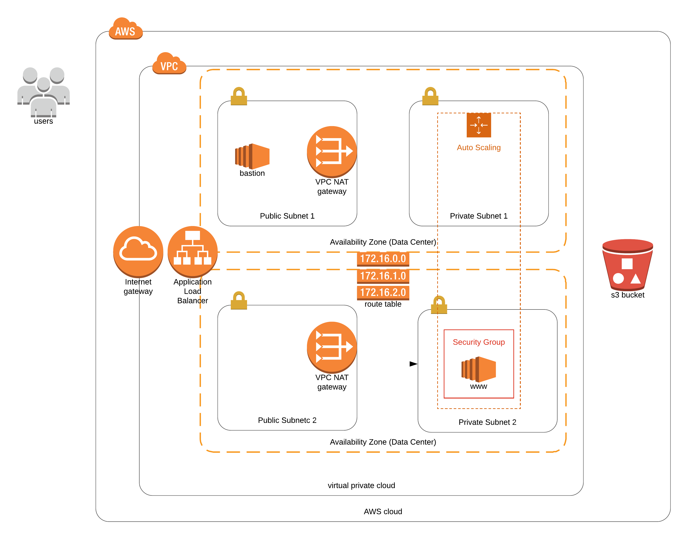

# cloudformation_apache_s3
> Matthew Flood

> Udacity project for Deploy Infrastructure as Code (IAC)

> This project creates the diagram and CloudFormation scripts to create
a network architecture and services within it to host an Apache-hosted webapp.

## Create the Network Architecture

```
cd network/
./create_network.sh
./describe_network.sh
```

## Create the App Architecture

```
cd app/
./create_app.sh
./describe_app.sh
```

## Working Test

[http://udaci-webap-t4dz7pf58wc1-1445586866.us-west-2.elb.amazonaws.com/](http://udaci-webap-t4dz7pf58wc1-1445586866.us-west-2.elb.amazonaws.com/)


## Architecture Diagram


